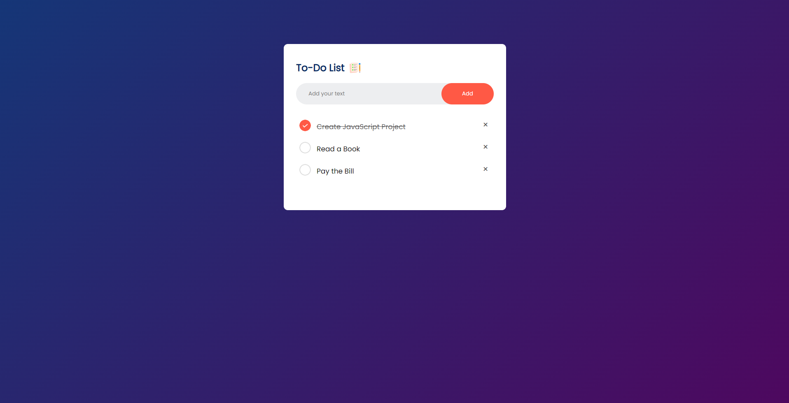

<!DOCTYPE html>
<html lang="en">
<head>
    <meta charset="UTF-8">
    <meta name="viewport" content="width=device-width, initial-scale=1.0">
    <title>README.md for Todo Web App</title>
    
</head>
<body>
    <h1>Todo Web App</h1>
    
This is a simple Todo web application created using HTML, CSS, and JavaScript.

    
    <h2>Features</h2>
    <ul>
        <li>Add tasks</li>
        <li>Mark tasks as completed</li>
        <li>Delete tasks</li>
    </ul>

    <h2>Screenshot</h2>
    

    <h2>How to Use</h2>
    <ol>
        <li>Download or clone the repository.</li>
        <li>Open <code>index.html</code> in your web browser.</li>
        <li>Start managing your tasks!</li>
    </ol>     

    <h2>Author</h2>
    
Saurabh Meshram.

</body>
</html>
